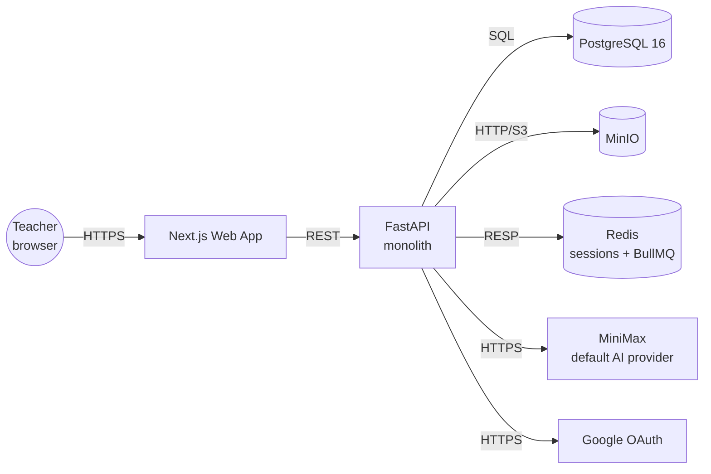
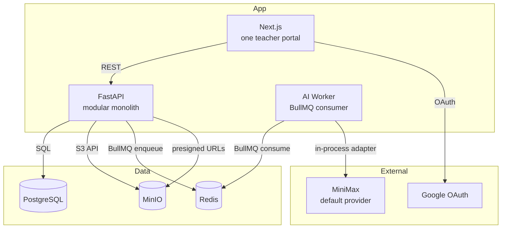
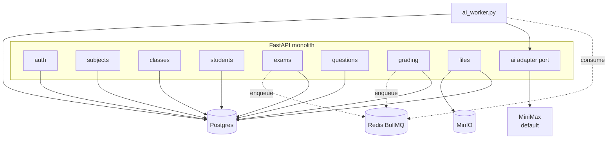
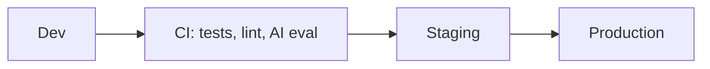

# Architecture — Teacher AI Exam Tool

> **Product:** Teacher AI Exam Tool (modular monolith)
> **Status:** Draft v1.0
> **Last updated:** 2026-06-18
> **Related docs:** [PRD.md](./PRD.md) · [ERD.md](./ERD.md) · [AUTH.md](./AUTH.md) · [API_CONTRACT.md](./API_CONTRACT.md)

Realizes the requirements in [PRD.md](./PRD.md) over the data model in [ERD.md](./ERD.md). Operational concerns are defined in [OBSERVABILITY.md](./OBSERVABILITY.md).

---

## 1. Goals & principles

| # | Principle | Implication |
|---|---|---|
| P1 | **Single-tenant; owner-scoped** | Every tenant-owned table has `owner_id`; every query is filtered by the signed-in teacher's id. |
| P2 | **Modular monolith** | One FastAPI process with internal modules; module seams kept explicit so features can be extracted later without rewriting. |
| P3 | **Stateless compute, stateful backends** | App tier scales horizontally; state lives in Postgres/MinIO/Redis. |
| P4 | **Async for heavy work** | AI generation/grading go through a Redis-backed queue (BullMQ). |
| P5 | **AI is assistive, never unauditable** | Every AI grade is reviewable and overridable; low-confidence items flagged before finalization. |
| P6 | **Untrusted uploads** | Student/teacher uploads (images, PDFs) are untrusted input — structured-output-only, no tools, no secrets in model context. |
| P7 | **No PII in logs** | IDs and counts only; no student names or content. |

---

## 2. System context



- **Teacher** is the only human actor.
- **MiniMax** (via the OpenAI-compatible API) is the default AI provider; the adapter is swappable (ADR-009).
- **Google** is used only for OAuth identity.

---

## 3. Container view



- **`web`** — Next.js App Router, one portal (teacher). RSC for static pages, TanStack Query for data.
- **`api`** — FastAPI modular monolith. Owns all HTTP routes, orchestrates modules, calls the AI adapter in-process for **non-async** AI tasks (cheap triage), and **enqueues** heavy work (full generation, grading) to BullMQ.
- **`worker`** — a separate process (same repo, `workers/ai_worker.py`) that consumes BullMQ and calls the AI adapter; updates `ai_job` rows.
- **`pg`**, **`minio`**, **`redis`** — see §5.

---

## 4. Technology stack

| Layer | Choice | Why |
|---|---|---|
| Frontend | **Next.js (App Router) + React 19 + TypeScript + Tailwind v4**, TanStack Query | RSC + simple data layer; matches the single-portal scope |
| Backend | **FastAPI (Python 3.12) + SQLAlchemy 2.x + Alembic** | Best AI ecosystem; modular monolith with explicit module boundaries |
| AI adapter | **`openai>=1.0` Python SDK** pointed at **MiniMax's OpenAI-compatible API** (`https://api.minimax.io/v1`), behind the `AIProvider` port (ADR-009) | Default provider; swappable to OpenAI / Vertex / Bedrock later |
| Async jobs | **BullMQ** (Redis) | Simple, durable, no separate Kafka |
| DB | **PostgreSQL 16** | Relational integrity, JSONB, partitioning if needed |
| Object storage | **MinIO** | S3-compatible; self-hosted; exactly what the user asked for |
| Cache/Queue | **Redis** | Session/token store + BullMQ broker |
| Auth | **Google OAuth 2.0** + JWT access + rotating refresh | Per PRD FR-AUTH |
| PDF gen | **WeasyPrint** (HTML→PDF) | Clean templating for questions/answers PDFs |
| Excel parse | **openpyxl** | Standard for `.xlsx`; column-headers API fits the drag-to-map UX |

> **AI provider keys live only in the API/worker environment.** Never committed to the repo. The active provider is selected by `AI_PROVIDER` env (default `minimax`); the default adapter reads `MINIMAX_API_KEY`. The orchestration, schemas, persistence, and safety gates are provider-independent.

---

## 5. Data layer

- **PostgreSQL 16** — single primary; read replicas later if needed. Tables per [ERD.md](./ERD.md).
- **Owner-scoping** — every tenant-owned table has `owner_id UUID NOT NULL → user.id`. All repository queries take `owner_id` as an argument (see [BACKEND_CONVENTIONS.md §3](./BACKEND_CONVENTIONS.md)).
- **No RLS** — replaced by mandatory `owner_id` filter in the data layer (SQLAlchemy core enforces it on every repo method). Single tenant makes RLS unnecessary; defense-in-depth is `owner_id` FK + a CI test that cross-owner access returns zero rows.
- **Indexes** — `(owner_id, id)` on every tenant table; plus per-table lookups (`(exam_id)`, `(student_id)`, etc.). See [DATABASE_SCHEMA.md §7](./DATABASE_SCHEMA.md).
- **MinIO** — holds all binary blobs:
  - `sources/{owner_id}/{exam_id}/{filename}` — uploaded source image/PDF
  - `exams/{owner_id}/{exam_id}/questions.pdf`, `answers.pdf` — generated PDFs
  - `grading/{owner_id}/{run_id}/{student_id}.pdf|jpg` — uploaded student answers
  - `benchmarks/{owner_id}/{exam_id}/{filename}` — uploaded benchmark PDFs
  - Presigned URLs for upload (PUT) and download (GET) — client never sends binary through the JSON API.
- **Redis** — `session:{sid}` → user payload + refresh family; BullMQ queues (`ai:generation`, `ai:grading`).
- **Migrations** — Alembic, forward-only, expand/contract; one migration per logical change.
- **Backups/DR** — Postgres WAL archiving for PITR (RPO ≤ 5 min, RTO ≤ 1 h per PRD §6); MinIO bucket replication if needed later.

---

## 6. Logical / component architecture



Each module owns its tables and never reads another module's tables — cross-module calls via injected services. The **AI adapter lives in-process**; the worker is the only consumer of long-running AI tasks.

---

## 7. AI subsystem (in-process)

> Realizes PRD §4.4 (generation), §4.6 (grading), §4.7 (async). Backed by `EXAM`, `QUESTION`, `ANSWER_KEY`, `GRADING_RUN`, `GRADING_ITEM`, `FILE_ASSET`, `AI_JOB`. Deep spec: [AI_SUBSYSTEM_SPEC.md](./AI_SUBSYSTEM_SPEC.md).

### 7.1 Provider adapter (ADR-009)

A narrow `AIProvider` protocol that any provider (MiniMax, OpenAI, Anthropic, Vertex, Bedrock, …) can implement:

```python
class AIProvider(Protocol):
    name: str
    models(self) -> TierMap            # {'cheap': <id>, 'premium': <id>}
    generate_structured(self, *, tier, system, content, schema,
                        cache_prefix, effort) -> StructuredResult
    submit_batch(self, requests) -> BatchHandle
    poll_batch(self, handle) -> BatchStatus
```

The default **MiniMax adapter** (via OpenAI-compatible API) maps both `cheap → MiniMax-M2.7` and `premium → MiniMax-M2.7` at MVP. The tier-routing seam stays so a future fast/large pair can be configured later. Verify model IDs against current MiniMax docs before implementation — they shift between releases.

### 7.2 Generation flow

```mermaid
sequenceDiagram
  participant T as Teacher (UI)
  participant API as FastAPI
  participant W as AI Worker
  participant AI as AI Adapter
  participant C as MiniMax

  T->>API: POST /exams/:id/generate { source?, config }
  API->>API: insert AI_JOB(queued)
  API-->>T: 202 { ai_job }
  API->>W: enqueue (BullMQ)
  W->>AI: generate_structured (image / pdf / text content)
  AI->>C: structured-output call (JSON schema)
  C-->>AI: questions[] + answers[]
  AI-->>W: StructuredResult
  W->>API: write QUESTIONS, ANSWER_KEY, update AI_JOB(done)
  T->>API: GET /ai-jobs/:id → done; fetch /exams/:id/questions
```

- Generated questions land with `status=in_review`. The teacher reviews/edits/approves and `POST /exams/:id/publish`.
- The answer key is also written to `EXAM.answer_key` JSONB and a `FILE_ASSET` PDF (so it's available as a downloadable artifact and as the default benchmark for grading).

### 7.3 Grading flow

```mermaid
sequenceDiagram
  participant T as Teacher (UI)
  participant API as FastAPI
  participant W as AI Worker
  participant AI as AI Adapter
  participant C as MiniMax

  T->>API: POST /grading-runs { exam_id, benchmark }
  API->>API: insert GRADING_RUN + GRADING_ITEMs
  loop per student
    T->>API: POST /grading-runs/:id/upload (file)
    API->>API: store FILE_ASSET, enqueue AI_JOB
  end
  W->>AI: grade.upload (file bytes + answer key + questions)
  AI->>C: structured-output grading
  C-->>AI: per-question scores + confidence
  AI-->>W: GradingResult
  W->>API: write GRADING_ITEM.scores, .confidence, .flagged
  end
  T->>API: review flagged items, override scores
  T->>API: POST /grading-runs/:id/finalize
```

- Confidence < threshold → `flagged=true`; finalize is blocked until all flagged items are reviewed (or explicitly waived).
- The teacher always sees the original AI score alongside any override, both recorded.

### 7.4 Safety

- **Structured-output-only** for all AI calls (`output_config.format.json_schema`). No tools, no secrets, no student IDs of other students in context.
- **Content/instruction separation**: rubric + answer key are operator-channel; uploaded student/source material is data-channel.
- **Output validation**: scores clamped to `[0, max_score]` server-side; per-question shapes validated against the schema; anomalies flagged.
- **Refusal handling**: refusal/error from the model routes the item to `flagged=true` rather than failing the run.

---

## 8. API design

- **Style:** REST, JSON, snake_case. Cursor pagination for lists. RFC 7807 errors with a stable `code`.
- **Versioning:** URI-versioned (`/api/v1`); additive only within v1.
- **Auth:** Google OAuth (authorization-code flow). Access JWT in `Authorization: Bearer`, refresh via HttpOnly cookie. See [AUTH.md](./AUTH.md).
- **Idempotency:** `Idempotency-Key` required on AI-job-creation and grading-finalize endpoints.
- **Uploads:** two-step — `POST /uploads/presign` returns a MinIO presigned URL + `storage_key`; client PUTs bytes; subsequent endpoints take `storage_key`.
- **Errors:** RFC 7807 + stable codes (`UNAUTHENTICATED`, `FORBIDDEN`, `NOT_FOUND`, `VALIDATION`, `CONFLICT`, `QUOTA_EXCEEDED`, etc.). Cross-owner resources → `404 NOT_FOUND` (never `403`).
- **Rate limits:** basic per-token limits; not heavily tuned at MVP.
- **Docs:** OpenAPI 3.1 generated from FastAPI; canonical in [API_CONTRACT.md](./API_CONTRACT.md).

---

## 9. Authentication & authorization

Realizes PRD §4.1. Deep spec: [AUTH.md](./AUTH.md).

- **AuthN:** Google OAuth only. No password. JWT access (15 min) + opaque refresh (30 d, rotating, family-revoked).
- **AuthZ:** single role (the teacher). Every request is owner-scoped: `owner_id = current_user.id`. No permission catalog, no RBAC matrix.
- **Token signing:** EdDSA (or RS256); key in a vault; JWKS at `/.well-known/jwks.json`.

---

## 10. Scalability, availability & resilience

- **Stateless tier** behind a single FastAPI process (or autoscaled replicas); sessions are in Redis.
- **AI burst:** BullMQ absorbs spikes; AI worker autoscaled on queue depth. AI down → fallback to manual grading (FR-G.7).
- **DB:** read replicas later if needed. MinIO scales by adding drives/nodes.
- **Resilience:** retries with backoff + jitter on AI calls (with idempotency keys); circuit breaker on the AI provider; graceful degradation to manual grading.
- **Availability:** 99.9% SLO target. Backups + PITR per PRD §6.

---

## 11. Deployment & environments



- **Dev:** local Docker Compose — `api`, `web`, `postgres`, `minio`, `redis`, `ai-worker`.
- **Staging:** prod-like with anonymized fixtures.
- **Production:** the same Compose topology, hardened (TLS, secrets manager, backups).
- See [DEPLOYMENT.md](./DEPLOYMENT.md) for the compose file, env vars, and probes.

---

## 12. Cross-cutting concerns

| Concern | Approach |
|---|---|
| **Config** | 12-factor; secrets in vault; per-user settings live in `user.settings` JSONB |
| **Idempotency** | AI jobs + grading finalize carry idempotency keys |
| **Testing** | Pytest unit; integration via Testcontainers (Postgres + MinIO); owner-isolation tests; AI golden-set evals |
| **Observability** | OTel → Prometheus/Loki/Tempo; see [OBSERVABILITY.md](./OBSERVABILITY.md) |

---

## 13. Key end-to-end flows

### 13.1 Create exam → generate → review → publish
1. Teacher creates exam: subject + units + count + type (+ optional source image/PDF).
2. `POST /exams/:id/generate` → 202 + AI_JOB.
3. Worker calls AI adapter → questions + answer key written.
4. Teacher reviews/edits/approves → publish.

### 13.2 Grade exam → finalize
1. Teacher creates grading run, chooses benchmark (AI-generated or upload).
2. Teacher uploads one answer file per student.
3. Worker grades each; flagged items surfaced.
4. Teacher reviews overrides → finalize → CSV export.

---

## 14. Architecture Decision Records

| ADR | Decision | Status |
|---|---|---|
| ADR-001 | Single FastAPI monolith with in-process AI adapter; BullMQ for async | Accepted |
| ADR-003 | Transactional outbox (optional) | Accepted |
| ADR-004 | Structured-output-only AI | Accepted |
| ADR-005 | Confidence + flag-for-review gate on AI grades | Accepted |
| ADR-006 | Tiered model routing (cheap → premium) + caching + batch | Accepted |
| ADR-007 | UUID v7 primary keys | Accepted |
| ADR-009 | AI provider is a configurable adapter (MiniMax default) | Accepted |

Full ADRs in [`docs/adr/`](./adr/). Index: [adr/README.md](./adr/README.md).

---

## 15. Open architectural questions

- ORM choice: SQLAlchemy 2.x (default) vs. SQLModel. Recommend SQLAlchemy 2.x + Alembic; SQLModel adds little here.
- BullMQ vs. ARQ vs. in-house asyncio worker. Recommend BullMQ for simplicity at MVP.
- Whether to deploy `ai-worker` as a sidecar of `api` or a separate service. Default: separate process, same image, separate command.