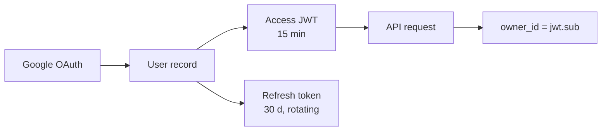

# Authentication & Authorization — Teacher AI Exam Tool

> **Product:** Teacher AI Exam Tool
> **Status:** Implementation-ready v1.0
> **Last updated:** 2026-06-18
> **Derives from:** [ARCHITECTURE.md §8, §9](./ARCHITECTURE.md) · [DATABASE_SCHEMA.md §6](./DATABASE_SCHEMA.md) (identity tables)
> **Consumed by:** [API_CONTRACT.md](./API_CONTRACT.md) · [BACKEND_CONVENTIONS.md](./BACKEND_CONVENTIONS.md)

This is the concrete spec for **authentication** (who you are) and **authorization** (what you can do). Single-teacher, Google OAuth only.

---

## 1. Model overview

The app has one actor (the teacher) and one role. No RBAC, no permissions catalog, no multi-school memberships.



---

## 2. Authentication

### 2.1 Google OAuth flow

```
Teacher → GET /auth/google
       → Redirect to Google (consent screen)
       → Google → GET /auth/google/callback?code=…
       → Exchange code for tokens
       → Upsert user (email + full_name from Google profile)
       → Encrypt & store google_token (access + refresh)
       → Mint access JWT + issue refresh cookie
       → Redirect to /dashboard
```

**Onboarding:** the first time a Google account hits `/auth/google/callback`, the app creates a `user` row (upsert on `google_sub`). No separate invitation flow needed — Google is the source of truth.

**Re-consent:** if the stored refresh token is invalid/expired, re-trigger the OAuth flow silently (no need to re-authorize if the Google session is live).

### 2.2 Token strategy — JWT access + rotating refresh

| Token | Lifetime | Storage | Contents |
|---|---|---|---|
| **Access** | 15 min | In-memory (JS) — never `localStorage` | Signed JWT |
| **Refresh** | 30 d (sliding) | `HttpOnly; Secure; SameSite=Strict` cookie | Opaque random 256-bit; hashed + stored in Redis |

- **Access** is a stateless JWT (no DB hit on verify).
- **Refresh** is opaque + server-side so it can be revoked instantly. Redis key: `refresh:{hash} → {user_id, exp}`.
- **Rotation with reuse detection:** each `/auth/refresh` issues a new refresh token and invalidates the old within the same family. If a reused (rotated-out) token is presented, the **entire family is revoked** and the user must re-authenticate via Google.

### 2.3 Access token claims

```jsonc
{
  "sub": "<user.id>",         // owner's UUID — used as owner_id everywhere
  "email": "<user.email>",
  "name": "<user.full_name>",
  "iat": 1749700000,
  "exp": 1749700900
}
```

> No `school_id`, `membership_id`, `roles`, or `perms` — there is one owner per table and one role.

### 2.4 Token signing

- Asymmetric (EdDSA or RS256); private key in a vault; JWKS published at `/.well-known/jwks.json` for verification.
- Key rotation with overlapping `kid`s.

---

## 3. Authorization — owner scoping

All tenant-owned data is scoped by `owner_id`. The signed-in teacher can only read/write their own rows.

### 3.1 Owner resolution

Every API request carries a valid access JWT. The FastAPI `deps.py` (`get_current_user()`) decodes the JWT and returns the `User` row. Every repository method takes `owner_id: UUID` as a required first argument; queries always filter `WHERE owner_id = :owner_id`.

### 3.2 Enforced paths

| Layer | Mechanism |
|---|---|
| FastAPI deps | `get_current_user()` decodes JWT → `user.id` |
| Service | Passes `owner_id = current_user.id` to all repo calls |
| Repository | All queries add `WHERE owner_id = :owner_id` |
| CI tests | Owner-isolation suite: set `owner_id=A`, attempt to read B's rows → assert zero rows returned |

### 3.3 Owner filter examples

```python
# Good (explicit)
result = await db.execute(
    select(Exam).where(Exam.owner_id == owner_id)
)

# Bad (no filter — catches the CI test)
result = await db.execute(select(Exam))  # → fail
```

---

## 4. Secrets & keys

- **Google OAuth credentials:** `GOOGLE_CLIENT_ID`, `GOOGLE_CLIENT_SECRET` in env / vault.
- **JWT signing key:** in vault, not in env or repo.
- **Google tokens:** encrypted at rest with AES-256 (envelope encryption with a per-user data key stored in `google_token`; master key in vault).
- **AI provider keys:** `MINIMAX_API_KEY` in env (vault for production). See [AI_SUBSYSTEM_SPEC.md §1](./AI_SUBSYSTEM_SPEC.md).

---

## 5. Session lifecycle

| Action | Effect |
|---|---|
| Sign in | Access JWT (15 min) + refresh cookie (30 d) |
| Refresh | New access JWT + new refresh token (old invalidated) |
| Reuse old refresh | Family revoked → must re-authenticate with Google |
| Sign out | Delete refresh from Redis; access JWT expires naturally |
| Manual sign out on another device | Refresh still valid until expiry (≤ 30 d); rotation defeats this if the attacker uses the token first |

---

## 6. Error codes (RFC 7807)

| HTTP | `code` | Meaning |
|---|---|---|
| 401 | `UNAUTHENTICATED` | Missing / invalid / expired access token |
| 403 | `FORBIDDEN` | Attempting another user's resource (owner mismatch) |
| 404 | `NOT_FOUND` | Resource not found in this owner's scope |

> `NOT_FOUND` over `FORBIDDEN` for cross-owner resources: we filter to zero rows and 404, never confirming existence.

---

## 7. Security notes

- **Brute-force on refresh token:** per-IP rate limits (Redis) + exponential backoff on failures.
- **No PII in tokens:** only `sub` (UUID), `email`, `name` — no student data.
- **CSRF:** refresh cookie is `SameSite=Strict` + path-scoped to `/auth`; state-changing requests use `Authorization: Bearer` header.
- **Google token encryption:** access/refresh tokens from Google are encrypted before storing in `google_token` (per §4).
- **Cookie security:** `Secure` in production (HTTPS only); `HttpOnly` prevents JS read; `SameSite=Strict` blocks cross-site use.

---

## 8. Open items

- **Refresh token expiry vs re-auth:** if the user hasn't used the app in 30 d and the refresh token expires, they re-authenticate via Google. Confirm whether Google re-prompts for consent after token expiry.
- **Avatar:** stored as `user.avatar_url` from Google profile; no Gravatar fallback needed.