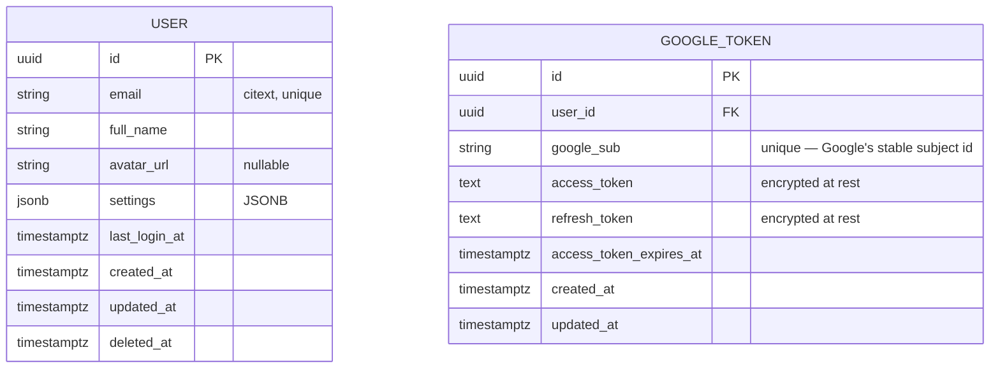
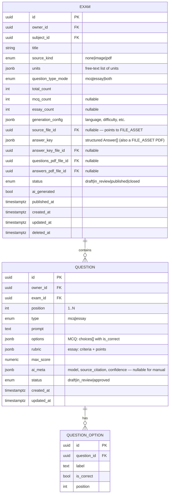
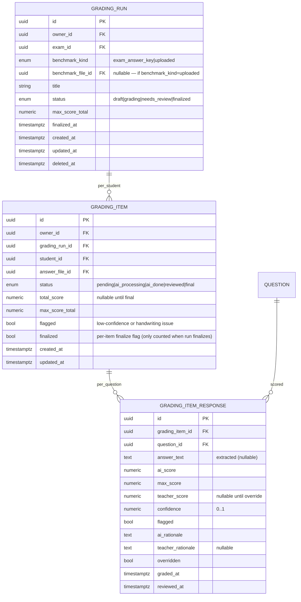
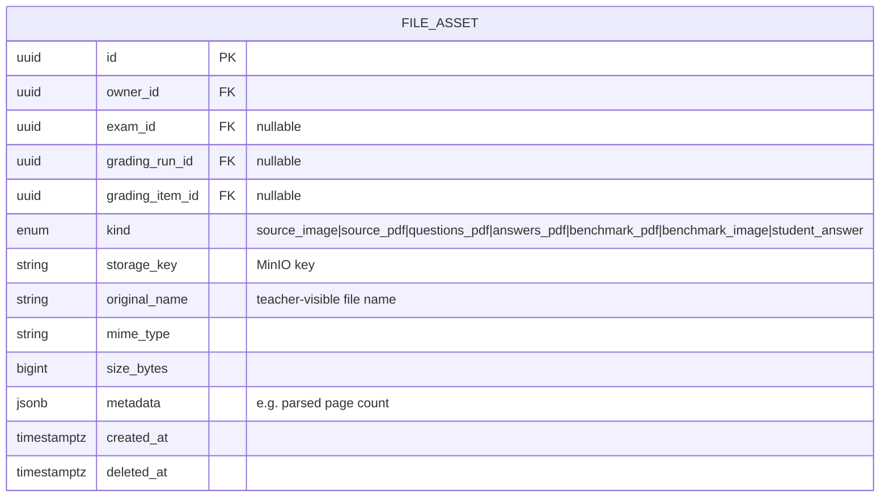
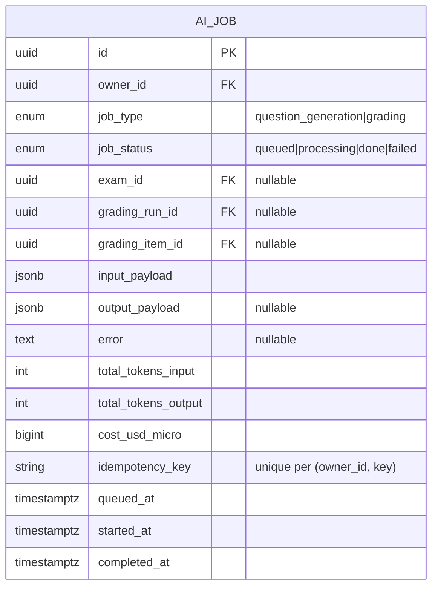

# Entity Relationship Diagram — Teacher AI Exam Tool

> **Product:** Teacher AI Exam Tool
> **Status:** Draft v1.0
> **Last updated:** 2026-06-18
> **Datastore:** PostgreSQL 16 (primary OLTP)
> **Related docs:** [PRD.md](./PRD.md) · [ARCHITECTURE.md](./ARCHITECTURE.md) · [DATABASE_SCHEMA.md](./DATABASE_SCHEMA.md)

This document defines the logical data model backing the requirements in [PRD.md](./PRD.md). Physical concerns (types, indexes, partitions, migrations) are covered in [DATABASE_SCHEMA.md](./DATABASE_SCHEMA.md).

---

## 1. Modeling conventions

- **Primary keys:** `UUID` v7 (time-ordered) named `id` (ADR-007).
- **Owner scoping:** every tenant-owned table has `owner_id UUID NOT NULL → user.id`. The runtime queries always carry `WHERE owner_id = :current_user`. See [AUTH.md](./AUTH.md).
- **Timestamps:** `created_at`, `updated_at` (`TIMESTAMPTZ`, UTC). Auditable tables add `created_by`, `updated_by` → `user.id`.
- **Soft delete:** `deleted_at TIMESTAMPTZ NULL`; default queries filter `deleted_at IS NULL`. Hard purge per retention policy.
- **Enums:** native Postgres `ENUM` types; shown as `«enum»` in diagrams.
- **JSONB:** used where structure varies (answer keys, AI metadata, question options).
- **Naming:** singular table names, `snake_case`, FK columns suffixed `_id`.
- **Files:** binary blobs live in **MinIO**; the `file_asset` table holds the metadata + `storage_key`.

---

## 2. High-level domain map

```mermaid
erDiagram
    USER ||--o{ SUBJECT : owns
    USER ||--o{ CLASS : owns
    USER ||--o{ STUDENT : owns
    CLASS ||--o{ CLASS_SUBJECT : teaches
    SUBJECT ||--o{ CLASS_SUBJECT : taught_to
    CLASS ||--o{ CLASS_ENROLLMENT : enrolls
    STUDENT ||--o{ CLASS_ENROLLMENT : enrolled_in
    USER ||--o{ EXAM : creates
    SUBJECT ||--o{ EXAM : scopes
    EXAM ||--o{ QUESTION : contains
    QUESTION ||--o{ QUESTION_OPTION : has
    EXAM ||--|| ANSWER_KEY : benchmark
    USER ||--o{ GRADING_RUN : creates
    EXAM ||--o{ GRADING_RUN : grades
    GRADING_RUN ||--o{ GRADING_ITEM : per_student
    STUDENT ||--o{ GRADING_ITEM : graded
    QUESTION ||--o{ GRADING_ITEM_RESPONSE : scores
    USER ||--o{ FILE_ASSET : owns
    EXAM ||--o{ FILE_ASSET : attached_to
    GRADING_RUN ||--o{ FILE_ASSET : attached_to
    USER ||--o{ AI_JOB : triggered
    EXAM ||--o{ AI_JOB : triggers
    GRADING_RUN ||--o{ AI_JOB : triggers
```

---

## 3. Subdomains

1. **Identity** — `user`, `google_token`.
2. **Subjects & Classes** — `subject`, `class`, `class_subject`, `student`, `class_enrollment`.
3. **Exams & Questions** — `exam`, `question`, `question_option`, `answer_key`.
4. **Grading** — `grading_run`, `grading_item`, `grading_item_response`.
5. **Files** — `file_asset`.
6. **Async AI** — `ai_job`.

---

## 4. Detailed entity diagrams

### 4.1 Identity



Notes:
- One user = one Google account = one teacher (PRD scope).
- `GOOGLE_TOKEN` is per-user; access/refresh tokens encrypted at rest (AES-256, per-user KMS data key or app-level envelope).

### 4.2 Subjects & Classes

```mermaid
erDiagram
    SUBJECT {
        uuid id PK
        uuid owner_id FK
        string name "Physics"
        string code "PHYS"
        timestamptz created_at
        timestamptz updated_at
        timestamptz deleted_at
    }
    CLASS {
        uuid id PK
        uuid owner_id FK
        string name "Grade 10-A"
        int grade_level "nullable"
        int student_count "derived/cache"
        timestamptz created_at
        timestamptz updated_at
        timestamptz deleted_at
    }
    CLASS_SUBJECT {
        uuid class_id FK
        uuid subject_id FK
    }
    STUDENT {
        uuid id PK
        uuid owner_id FK
        string name
        string student_code "teacher-supplied id, nullable"
        string email "nullable"
        jsonb extra_columns "anything not in canonical fields"
        timestamptz created_at
        timestamptz updated_at
        timestamptz deleted_at
    }
    CLASS_ENROLLMENT {
        uuid id PK
        uuid owner_id FK
        uuid class_id FK
        uuid student_id FK
        timestamptz enrolled_at
        timestamptz deleted_at
    }

    SUBJECT ||--o{ CLASS_SUBJECT : "is taught to"
    CLASS   ||--o{ CLASS_SUBJECT : "includes"
    CLASS   ||--o{ CLASS_ENROLLMENT : enrolls
    STUDENT ||--o{ CLASS_ENROLLMENT : "enrolled in"
```

Notes:
- `STUDENT.extra_columns` preserves the original Excel columns the teacher mapped (FR-S.2 — "whatever columns user wants").
- `STUDENT` and `CLASS_ENROLLMENT` carry `owner_id` even though they live in the teacher's namespace; this keeps the index strategy uniform and prevents cross-owner lookups by accident.

### 4.3 Exams & Questions



Notes:
- `EXAM.answer_key` is structured JSONB paralleling the questions (index-aligned), suitable as the benchmark for grading without re-parsing the PDF.
- The `answer_key_file_id` and `questions_pdf_file_id` are written when the teacher downloads; they enable later re-download with the same name.

### 4.4 Grading



Notes:
- `GRADING_ITEM.flagged` = OR of all per-question `flagged` flags. Finalize is blocked while any item is `flagged && !reviewed`.
- `teacher_score` overrides `ai_score` when set; `overridden=true` records that a human changed the AI's call.

### 4.5 Files



Notes:
- `FILE_ASSET` covers everything: source image/PDF, generated questions/answers PDFs, benchmark upload, per-student answer upload.
- `original_name` is what the teacher sees; the `storage_key` is opaque to the user. Renaming the file = updating `original_name` (FR-F.2).
- Soft-deleted files have their MinIO object deleted lazily by a cleanup job (not blocking).

### 4.6 Async AI



Notes:
- One AI_JOB per generation (per exam) and per grading item (per student).
- Idempotency key ensures a retry doesn't double-grade.

---

## 5. Cross-cutting relationship summary

| Parent | Child | Cardinality | Notes |
|---|---|---|---|
| User | Subject | 1 : N | owner-scoped |
| User | Class | 1 : N | owner-scoped |
| User | Student | 1 : N | owner-scoped |
| User | Exam | 1 : N | owner-scoped |
| User | GradingRun | 1 : N | owner-scoped |
| Class | ClassSubject | 1 : N | M:N with Subject |
| Class | ClassEnrollment | 1 : N | |
| Student | ClassEnrollment | 1 : N | |
| Subject | Exam | 1 : N | |
| Exam | Question | 1 : N | |
| Question | QuestionOption | 1 : N | MCQ only |
| Exam | GradingRun | 1 : N | |
| GradingRun | GradingItem | 1 : N | one per student |
| GradingItem | GradingItemResponse | 1 : N | one per question |
| FileAsset | Exam | 0..1 : N | nullable FK |

---

## 6. Indexing & performance strategy

| Table | Key indexes | Rationale |
|---|---|---|
| All owner-owned tables | `(owner_id, id)`; leading on tenant queries | Fast owner filter + sequential scan ordering |
| `user` | unique `email` (citext) | Login lookup |
| `google_token` | unique `google_sub`; `(user_id)` | OAuth callback |
| `subject` / `class` / `student` | `(owner_id, name)`; `(owner_id, deleted_at)` | List + soft-delete filter |
| `class_enrollment` | unique `(class_id, student_id)`; `(student_id)` | Duplicate prevention + student lookups |
| `exam` | `(owner_id, status)`; `(subject_id)`; `(owner_id, created_at)` | List / dashboard |
| `question` | `(exam_id, position)` | Ordered list |
| `grading_run` | `(owner_id, status)`; `(exam_id)` | Dashboard / drilldown |
| `grading_item` | unique `(grading_run_id, student_id)`; `(grading_run_id, status, flagged)` | Finalize gate; review queue |
| `grading_item_response` | `(grading_item_id)`; `(question_id)` | Item detail; question stats |
| `file_asset` | `(owner_id, exam_id)`; `(owner_id, grading_run_id)`; `(owner_id, kind)` | Browse |
| `ai_job` | unique `(owner_id, idempotency_key)`; partial `(job_status) WHERE job_status IN ('queued','processing')` | Idempotency + queue stats |

---

## 7. Data integrity & lifecycle rules

- **Referential integrity:** FKs enforced; child rows check the parent's `owner_id` (composite FK).
- **Soft-delete cascade:** deleting an exam soft-deletes its `question`/`answer_key`/`file_asset` and `grading_run` rows; explicit admin reaper purges MinIO objects after a retention window.
- **Immutability:** finalized `grading_run`, finalized `grading_item`, and `ai_job` (after completion) are append-only.
- **PII handling:** `user.email`, `user.full_name`, `student.email` are PII. Soft-delete suffices for MVP; export/erasure is P2.
- **Retention:** per-owner configurable; default 1 year for AI artifacts.

---

## 8. Open modeling questions

- Should we model question `tags` (e.g. "kinematics", "force")? Not needed for MVP — units already cover topic grouping. P2 if we add a bank feature.
- Should `STUDENT.extra_columns` be a separate table for queryability? No — JSONB is enough at MVP scale (single teacher, hundreds of students).