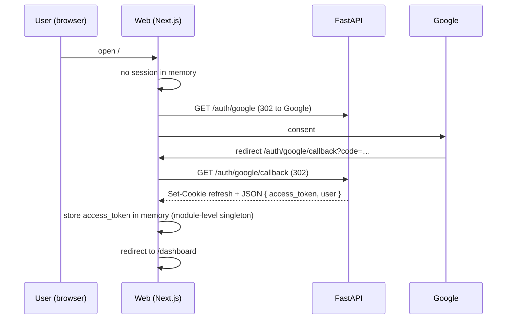
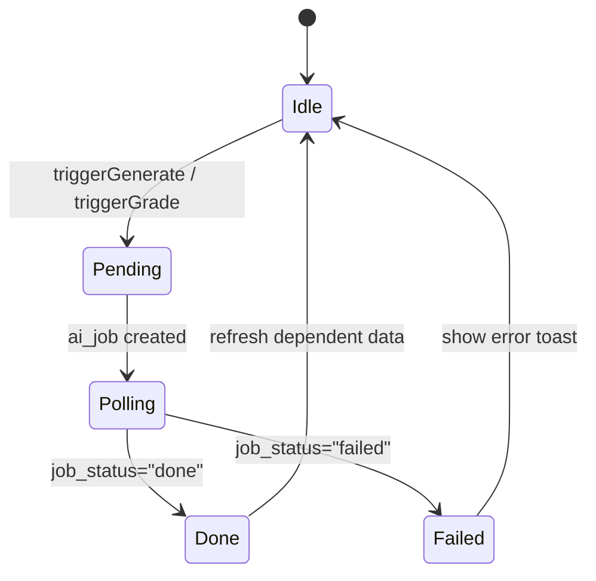

# Frontend Architecture — Teacher AI Exam Tool

> **Product:** Teacher AI Exam Tool
> **Status:** Implementation-ready v1.0
> **Last updated:** 2026-06-18
> **Derives from:** [PRD.md](./PRD.md) · [ARCHITECTURE.md](./ARCHITECTURE.md) · [API_CONTRACT.md](./API_CONTRACT.md) · [AUTH.md](./AUTH.md)
> **Consumed by:** [PAGE_SPEC.md](./PAGE_SPEC.md) · [COMPONENT_SPEC.md](./COMPONENT_SPEC.md)

How the **Next.js** web app is built: one teacher portal, one set of pages, the data layer (TanStack Query), the auth flow, the AI-job UX.

---

## 1. Goals & principles

- **One portal.** Teacher-only.
- **Simple auth:** Google OAuth, server-side session, JWT in memory.
- **Data layer:** TanStack Query (with cache invalidation) for all reads/writes; RSC for static-ish pages (dashboard, subject/class lists).
- **AI job UX:** optimistic loading → poll `/ai-jobs/:id` → toast/notification on completion.
- **No multi-tenant theming.** Single design system.

---

## 2. Stack

| Layer | Choice |
|---|---|
| Framework | **Next.js 15 (App Router) + React 19 + TypeScript** |
| Styling | **Tailwind CSS v4** + Radix UI primitives |
| Data | **TanStack Query v5** (server state) + Zod (validation) |
| Forms | **react-hook-form** + Zod resolver |
| Tables | **TanStack Table** |
| Auth | Custom (Google OAuth via backend) — store JWT in memory; refresh cookie handled by the backend |
| Charts | **Recharts** (dashboard only) |
| File download | Browser native `<a href={presigned_url} download>` |
| Icons | **lucide-react** |

> **No per-school theming.** The design tokens in [DESIGN_SYSTEM.md](./DESIGN_SYSTEM.md) are the only theme.

---

## 3. Project layout

```
web/
  app/
    layout.tsx                  # root: providers (Query, Auth, Theme)
    page.tsx                    # landing → /login if not authed, /dashboard if authed
    (auth)/
      login/page.tsx            # /login → "Continue with Google"
      callback/page.tsx         # /auth/callback (browser-side token capture)
    (app)/                      # protected layout: redirects to /login if no session
      layout.tsx                # shell: sidebar, top bar
      dashboard/page.tsx
      subjects/page.tsx
      subjects/[id]/page.tsx
      classes/page.tsx
      classes/[id]/page.tsx
      students/page.tsx
      students/import/page.tsx
      exams/page.tsx
      exams/new/page.tsx        # wizard
      exams/[id]/page.tsx
      exams/[id]/questions/page.tsx
      exams/[id]/files/page.tsx
      grading/page.tsx
      grading/new/page.tsx
      grading/[id]/page.tsx
      grading/[id]/items/[itemId]/page.tsx
  components/                   # see COMPONENT_SPEC.md
  lib/
    api.ts                      # typed fetch wrapper (returns DTOs, throws RFC 7807 errors)
    auth.ts                     # useSession(), refresh logic
    queryClient.ts
    schemas/                    # zod schemas mirroring API_CONTRACT
  hooks/
    useCurrentUser.ts
    useAiJob.ts                 # polling hook
    useUpload.ts                # presigned PUT
```

---

## 4. Auth flow



- **No `localStorage`.** Access token lives in an in-memory store (a singleton inside `lib/auth.ts`); refresh is an HttpOnly cookie set by the backend.
- **On page reload:** we have no access token in memory; we call `POST /auth/refresh` (cookie-driven) which returns a new access token. If that 401s, redirect to `/login`.
- **Tab focus:** on `visibilitychange`, if the access token is missing/expired, call `/auth/refresh` before any user action.

### 4.1 Session shape

```ts
type Session = { user: User; accessToken: string; expiresAt: number };
```

---

## 5. Data layer

All non-RSC reads/writes go through TanStack Query. RSC is used only for the dashboard counters + initial subject/class lists (cached, then revalidated on mutation).

```ts
// lib/api.ts
export async function apiFetch<T>(path: string, init: RequestInit = {}): Promise<T> {
  const token = getAccessToken();
  const res = await fetch(`${BASE}${path}`, {
    ...init,
    headers: {
      'Content-Type': 'application/json',
      ...(token ? { Authorization: `Bearer ${token}` } : {}),
      ...init.headers,
    },
    credentials: 'include',           // refresh cookie
  });
  if (res.status === 401) {
    const refreshed = await tryRefresh();
    if (refreshed) return apiFetch(path, init);
    await signOut();
    throw new UnauthenticatedError();
  }
  if (!res.ok) throw await ProblemError.fromResponse(res);
  return res.json() as Promise<T>;
}
```

**Invalidation rules:**
- `POST /exams` → invalidate `['exams']`.
- `POST /exams/:id/generate` → invalidate `['exam', id]` and `['ai-jobs']`; new `ai_job` polled via `useAiJob`.
- `PATCH /exams/:id/files/:fid` (rename) → invalidate `['exam', id, 'files']`.
- `POST /students/import` → invalidate `['students']`, `['classes', id, 'students']`.

---

## 6. AI job UX



```ts
// hooks/useAiJob.ts
export function useAiJob(jobId: string | null) {
  return useQuery({
    queryKey: ['ai-jobs', jobId],
    queryFn: () => apiFetch<AiJob>(`/ai-jobs/${jobId}`),
    enabled: !!jobId,
    refetchInterval: (q) => {
      const s = q.state.data?.job_status;
      return s === 'queued' || s === 'processing' ? 1500 : false;
    },
  });
}
```

The wizard shows a progress card with the AI job's status; on `done`, the next step (review queue, grading items) is unlocked and a toast confirms.

---

## 7. Uploads

```ts
// hooks/useUpload.ts
export function useUpload() {
  return async (file: File, kind: FileAssetKind, parentIds: { exam_id?: string; grading_run_id?: string }) => {
    const presign = await apiFetch<PresignResp>('/uploads/presign', {
      method: 'POST',
      body: JSON.stringify({ kind, ...parentIds, filename: file.name, mime_type: file.type, size_bytes: file.size }),
    });
    await fetch(presign.upload_url, { method: 'PUT', body: file, headers: presign.headers });
    return presign.storage_key;
  };
}
```

After upload, the calling form posts the returned `storage_key` (or registers a `file_asset` row first via `POST /exams/:id/files` then uses `file_asset_id`).

---

## 8. Error UX

| `code` | UX |
|---|---|
| `UNAUTHENTICATED` | silent redirect to `/login` |
| `FORBIDDEN` / `NOT_FOUND` | toast "Not found" + redirect to previous page |
| `VALIDATION` | inline form errors from `errors[]` |
| `CONFLICT` | toast with `detail` (e.g. flagged items remain) |
| `QUOTA_EXCEEDED` / `RATE_LIMITED` | toast "Try again in a moment" |
| `INTERNAL` | toast "Something went wrong" + `request_id` |

---

## 9. PDF download UX

Downloads are `<a href={downloadUrl} download={file.original_name}>` — the backend redirects to a MinIO presigned URL with a 5-min TTL.

---

## 10. Dashboard (RSC + hydration)

`/dashboard` is an RSC that preloads:
- Subject count, class count, student count, exam count, recent grading runs
- Three "quick actions": New Exam, New Grading Run, Import Students

Counts are RSC-fetched from `/api/v1/me/dashboard` (a synthesized endpoint returning aggregated counts). Subsequent navigations use TanStack Query.

---

## 11. Performance

- **RSC for read-mostly pages** (dashboard, list pages).
- **Cursor pagination** on lists (`limit=50`).
- **Image lazy-loading** for source/answer thumbnails.
- **AI job polling** uses `refetchInterval` (no WebSocket) — simpler.

---

## 12. Open items for the team

- **Client-side CSV/Excel preview:** openpyxl is server-only; use `read-excel-file` or `xlsx-stream-readers` for client-side preview (avoids round-trip for preview). Default: server-side preview (current API).
- **Notifications:** toasts only at MVP (no email/SMS).
- **Offline support:** out of scope.